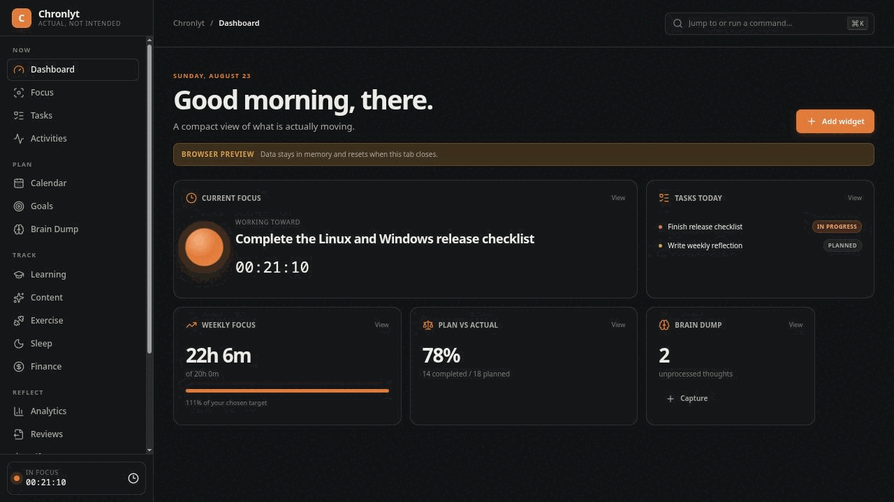
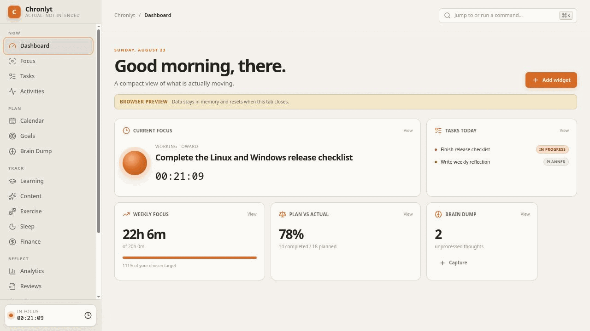
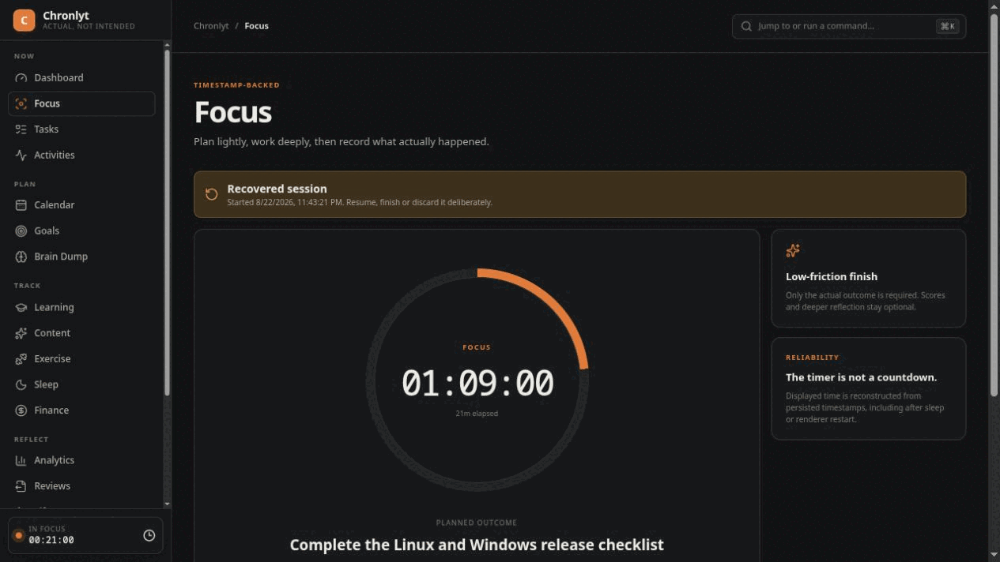
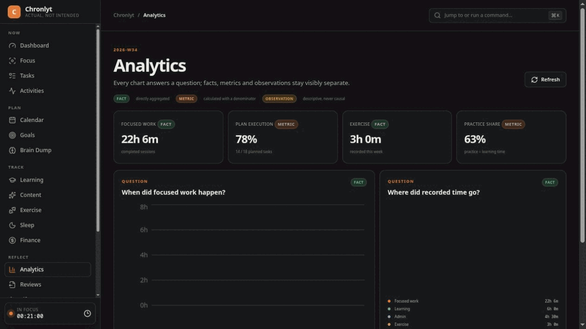
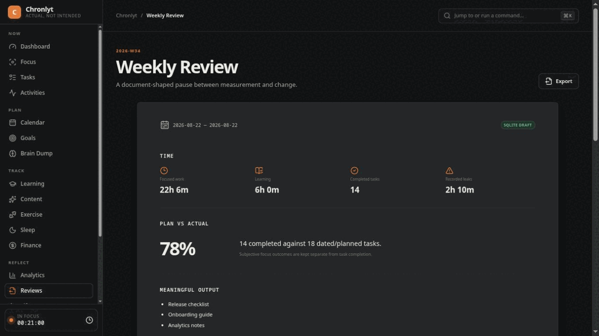
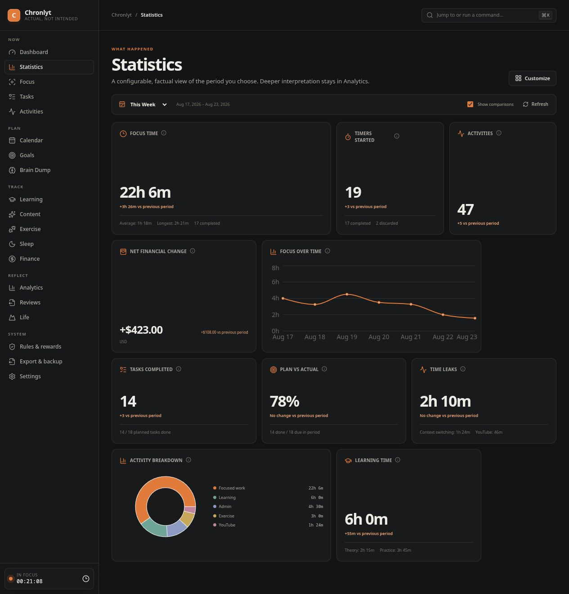

# Chronlyt

**Know where your time actually goes.**

Chronlyt is a privacy-first desktop application for tracking what you actually did, understanding where your time went, and improving what happens next.

It connects plans, focused work, activities, outcomes and weekly reflection while keeping your personal data under your control.

[Download](#download) · [Latest Release](https://github.com/n3d7/Chronlyt/releases/latest) · [Documentation](docs/user/README.md) · [Screenshots](#screenshots) · [Report a Bug](https://github.com/n3d7/Chronlyt/issues/new?template=bug_report.yml)



## Why Chronlyt?

Most productivity tools are good at recording intentions.

Chronlyt is designed to help record **reality**.

| Planned                      | What Chronlyt helps you see                                        |
| ---------------------------- | ------------------------------------------------------------------ |
| Spend the afternoon learning | Focus sessions, activity changes, completed outputs and time leaks |
| Finish three important tasks | Which outcomes were completed, changed or remained unfinished      |
| Avoid distractions           | When context switching appeared and what repeatedly surrounded it  |

Chronlyt helps compare:

* what you planned;
* what actually happened;
* what you produced;
* what you learned;
* where your time went;
* whether your week moved you toward your goals.

## Features

| Track & Focus     | Reflect & Improve    | Own Your Data                    |
| ----------------- | -------------------- | -------------------------------- |
| Focus Sessions    | Statistics           | Local-first storage              |
| Tasks             | Analytics            | Offline Markdown/JSON export     |
| Activity Timeline | Plan vs Actual       | Local backups                    |
| Brain Dump        | Weekly Reviews       | Optional AI Analysis             |
| Goals             | Rules & achievements | User-approved updates            |
| Learning          | Progress patterns    | No required cloud account        |
| Exercise & Sleep  | Gamification         | Privacy-focused design           |
| Finance           | Long-term reflection | User-controlled network features |

## Optional accounts

Chronlyt can be used without an account.

You may optionally sign in using:

* Google;
* Apple;
* verified email and password.

Accounts provide identity for future device-related features.

**Creating an account does not enable automatic sync and does not upload your existing local history.**

See [Accounts](docs/user/accounts.md) for more information.

## Screenshots

| Dashboard                                                             | Focus                                               |
| --------------------------------------------------------------------- | --------------------------------------------------- |
|  |  |

| Analytics                                           | Weekly Review                                               |
| --------------------------------------------------- | ----------------------------------------------------------- |
|  |  |



[View the complete screenshot set](docs/assets/screenshots/README.md), including Activities, AI Analysis and Settings.

## Privacy

Chronlyt is designed around a local-first model.

* Your personal behavioural data is stored locally by default.
* No Chronlyt account or cloud service is required for core functionality.
* No developer telemetry or third-party analytics SDK is included.
* No automatic crash-report upload.
* Core tracking, reviews, exports and backups work offline.
* AI features are optional.
* Behavioural data is not automatically uploaded.
* Before an AI request is sent, you choose what data to include and can review it first.
* Data Export is offline and independent from AI Analysis.
* Sensitive credentials are stored using operating-system credential facilities.

Read the full [Privacy document](PRIVACY.md).

## Download

Releases are distributed through [GitHub Releases](https://github.com/n3d7/Chronlyt/releases).

Available x86_64 packages may include:

* **Windows 10 / 11:** `Chronlyt-X.Y.Z-windows-x64-setup.exe`
* **Fedora / RPM-based Linux:** `Chronlyt-X.Y.Z-1.x86_64.rpm`
* **Debian / Ubuntu:** `Chronlyt_X.Y.Z_amd64.deb`
* **Generic Linux:** `Chronlyt-X.Y.Z-x86_64.AppImage`

Release assets may also include cryptographic signatures, update metadata and `SHA256SUMS.txt`.

> Chronlyt is currently pre-stable (`0.x`). Features, interfaces and data formats may change before `1.0`.

## Install

### Windows 10 / 11

1. Download the Windows installer from the latest release.
2. Run the installer.
3. Launch **Chronlyt** from the Start Menu.

Windows may display a SmartScreen reputation warning while releases are not Authenticode-signed.

You can verify the downloaded file against `SHA256SUMS.txt` when provided.

### Fedora / RPM-based Linux

```bash
sudo dnf install ./Chronlyt-*.rpm
```

### Debian / Ubuntu

```bash
sudo apt install ./Chronlyt_*.deb
```

### Generic Linux / AppImage

```bash
chmod +x Chronlyt-*.AppImage
./Chronlyt-*.AppImage
```

## AI Analysis

AI Analysis is optional.

You choose:

* the AI provider;
* model;
* time period;
* categories;
* level of detail.

Before anything is sent, Chronlyt lets you inspect the information included in the request.

The request is only sent after explicit confirmation.

API credentials are stored using the operating system's secure credential facilities.

Prefer a completely manual workflow?

Chronlyt can export Markdown or JSON locally so you can analyze the data using a tool of your choice.

**AI Analysis and Data Export are independent features.**

## Data ownership

Your Chronlyt data remains stored locally unless you explicitly use a feature that requires network communication.

Chronlyt supports:

* local exports;
* local backups;
* backup validation;
* safe restore workflows;
* user-controlled AI requests;
* optional account authentication.

Authentication credentials and AI API keys are designed to remain outside normal application exports and backups.

See:

* [Backup & Restore](docs/user/backup-and-restore.md)
* [Export](docs/user/export.md)
* [Troubleshooting](docs/user/troubleshooting.md)

## Statistics and background use

The configurable [Statistics workspace](docs/user/statistics.md) provides factual metrics, historical ranges and comparisons without replacing deeper Analytics.

Optional [Background Mode and Start at Login](docs/user/background-and-startup.md) allow supported local features such as Focus Sessions, Check-ins and notifications to continue while the main window is closed.

These options are user-controlled and do not automatically enable AI or behavioural-data sharing.

## Security

Security-sensitive credentials are stored using operating-system credential facilities where supported.

Application updates are designed to be cryptographically verified before installation.

Please do not report security vulnerabilities through public Issues.

See [Security Policy](SECURITY.md) for responsible vulnerability reporting.

## Documentation

The user documentation includes guides for:

* Getting Started
* Accounts
* Focus Sessions
* Tasks
* Activity Timeline
* Brain Dump
* Dashboard
* Statistics
* Weekly Reviews
* AI Analysis
* Export
* Backup & Restore
* Background Mode
* Updates
* Privacy
* Troubleshooting
* FAQ

[Open the user guide →](docs/user/README.md)

## Closed-source application

Chronlyt is a closed-source application.

This public repository contains product documentation, screenshots, release information, issue tracking and other public project resources.

**The application source code is maintained separately and is not published in this repository.**

## Status

Chronlyt is currently under active development and remains pre-stable.

The latest `0.x` release represents the currently supported version.

## Licensing

Chronlyt is proprietary, closed-source software.

This repository contains public documentation, release information,
and project resources. It does not contain the Chronlyt application
source code.

Copyright © 2026 [copyright holder]. All rights reserved.